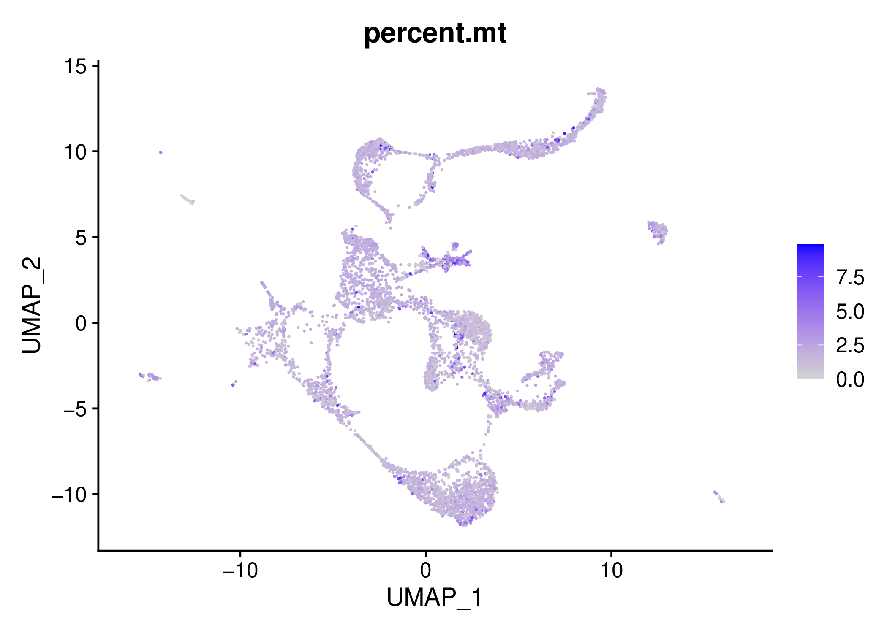
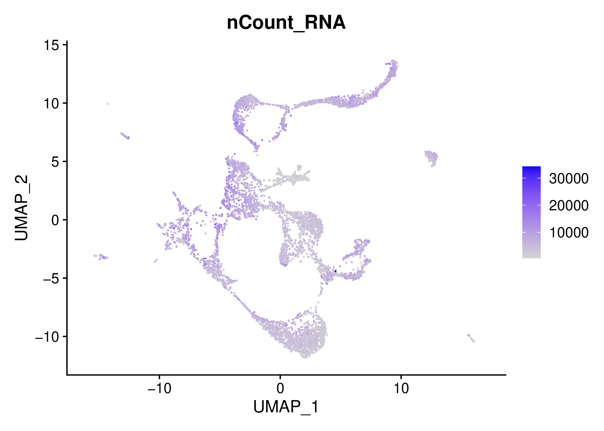
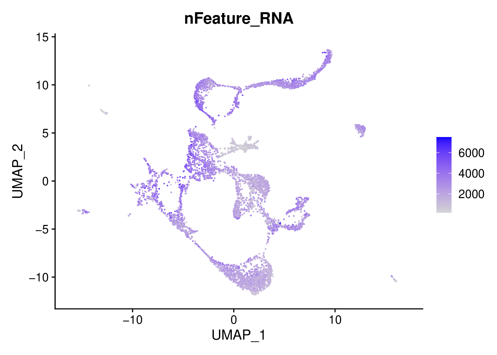
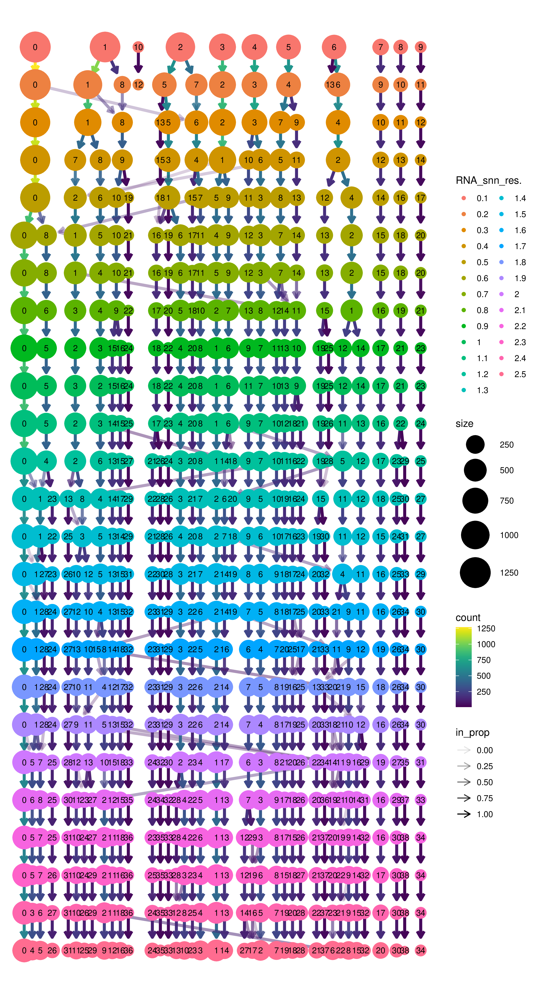

**********************************
Example run on Fetal Brain dataset 
**********************************

These samples are from  (La Manno et al., 2018) and you can download them here: https://www.dropbox.com/sh/1qn2odtnci0vvtr/AADPxHH-GR4h-OuQG0TLQyxWa?dl=0

Put them into a folder, lets say data/ and they will look like this:

.. code-block:: bash

    10X_17_029 
    10X_17_028

or more detailed

.. code-block:: bash

    data/10X_17_029
    data/10X_17_029/outs
    data/10X_17_029/outs/filtered_feature_bc_matrix
    data/10X_17_029/outs/filtered_feature_bc_matrix/features.tsv.gz
    data/10X_17_029/outs/filtered_feature_bc_matrix/barcodes.tsv.gz
    data/10X_17_029/outs/filtered_feature_bc_matrix/matrix.mtx.gz
    data/10X_17_028
    data/10X_17_028/outs
    data/10X_17_028/outs/filtered_feature_bc_matrix
    data/10X_17_028/outs/filtered_feature_bc_matrix/features.tsv.gz
    data/10X_17_028/outs/filtered_feature_bc_matrix/barcodes.tsv.gz
    data/10X_17_028/outs/filtered_feature_bc_matrix/matrix.mtx.gz

So, the data folder contains two samples called, 10X_17_028 and 10X_17_029, these will be our samples names during the analyses and the results will be
generated for two separate samples. You may change the sample names by simply changing the directory names if you like. 

    We can start a **cellsnake** minimal workflow which will generate the most basic outputs such as dimension reduction (PCA, UMAP and tSNE) and **ClusTree** plots for these two samples. 
    We can inspect the outputs and if we are happy with the parameters, we can do a full run.

Run this command for a **dry run**, you will see the IDs of the detected samples under data folder and the outputs which will be created by **cellsnake**.

Start with a dry run
####################

.. code-block:: bash

    cellsnake minimal data --dry

You should see something like below and many things that will be generated.

.. code-block:: bash

    Job stats:
    job                                    count    min threads    max threads
    -----------------------------------  -------  -------------  -------------
    all                                        1              1              1
    create_initial_raw_rds_and_trimming        2              1              1
    normalization_pca_rds                      2              1              1
    plot_clustree                              2              1              1
    plot_dimplots                              6              1              1
    plot_some_metrics                          2              1              1
    plot_some_technicals                       2              1              1
    total                                     17              1              1

Looks fine, then trigger a minimal workflow run. 

.. code-block:: bash

    cellsnake minimal data

.. note::

    Cellsnake may install some R packages, be patient. When it finishes, you will get a **results** directory containing the analyses of two different fetal brain samples.
    **analyses** directory contains intermediate files, but the main results are always in results folder.

You will see two sample results like this which shows that both samples were processed using MT percent cut off of 10% and resolution parameter of 0.8. 

.. code-block:: bash

    results/10X_17_028/percent_mt~10/resolution~0.8
    results/10X_17_029/percent_mt~10/resolution~0.8

QC
##

For example, you can inspect the QC filtering results by opening the **results/10X_17_028/percent_mt~10/resolution~0.8/technicals/** files under.

Another important forlder for QC is **results/10X_17_028/percent_mt~10/resolution~0.8/metrics/**

If you are satisfied with the QC, you may directly integrate these two samples or you can continue with alternative parameters. 
(We recommend to clean unused directories or create another folder and continue there with the desired parameters.)

Run a standard workflow
#######################
**Lets integrate the data and run standard workflow:**

.. code-block:: bash
    
    cellsnake integrate data

We can now work on the integrated object, the integrated object by default located at **analyses_integrated/seurat/integrated.rds**, cellsnake warns you if it cannot detect the correct file.

Now we tell cellsnake to work on the integrated object

.. code-block:: bash
    
    cellsnake integrated standard analyses_integrated/seurat/integrated.rds

.. note::

    Now you will see the results under the folder, here the MT percentage is auto because MT genes were already filtered per sample, so it wont be executed again. Do not confuse!

.. code-block:: bash

    results_integrated/integrated/percent_mt\~auto/resolution\~0.8

    

We can easily change the parameters, for example, lets use a different resolution, for example, 0.7 is a good resolution according to the **clustree plot**.

.. code-block:: bash
    
    cellsnake integrated standard analyses_integrated/seurat/integrated.rds --resolution 0.7

You can generate additional analyses with advanced command.

.. code-block:: bash

    cellsnake integrated advanced analyses_integrated/seurat/integrated.rds --resolution 0.7

It is also possible to use autoresolution on the integrated sample:

.. code-block:: bash

    cellsnake integrated advanced analyses_integrated/seurat/integrated.rds --resolution auto

