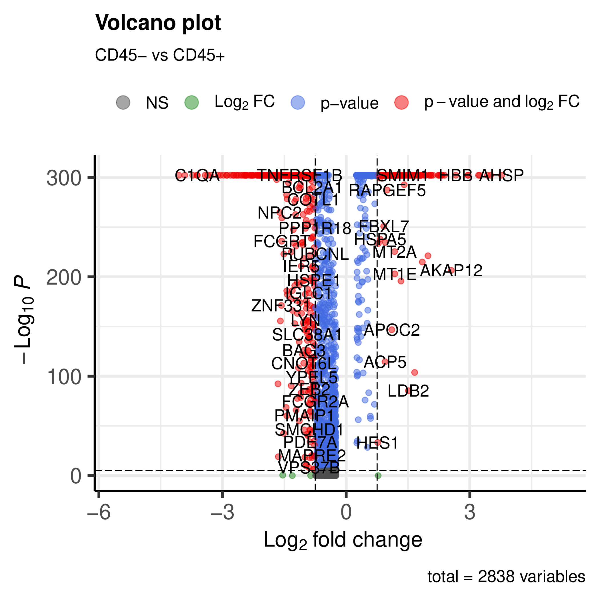

**********************************
Example run on Fetal Liver dataset 
**********************************
Cellsnake can be run directly using the Snakemake workflow. We recommend the wrapper but the Snakemake workflow gives more control in some use cases.

Let's try workflow on Fetal Liver dataset. You can apply this idea to your own samples.

Since this dataset have 6 samples, rather than one MT percentage, we can make it automatic so that each sample will be trimmed accordingly. 

Starting with a minimal run
===========================
A minimal run is also enough, we do not want to analyze samples separately.

.. code-block:: bash

    snakemake -j 20 --config option=minimal percent_mt=auto
    #cellsnake cli equivalent of this command is: cellsnake minimal data --percent_mt auto -j 20

Integration
===========
Then we can run integration.

.. code-block:: bash
    
    snakemake -j 10 --config option=integration
    #cellsnake cli equivalent of this command is: cellsnake integrate data

Work on the integrated sample
=============================
Now it is time to work on the integrated sample. We can run full advanced run on the integrated object which is always generates at the same location.

.. code-block:: bash

    snakemake -j 40 --config  datafolder=analyses_integrated/seurat/integrated.rds resolution=auto option=standard is_integrated_sample=True --rerun-incomplete
    #cellsnake cli equivalent of this command is: cellsnake integrated standard analyses_integrated/seurat/integrated.rds --resolution auto  -j 40

We can include the metadata to compare different groups
=======================================================

You can also run the workflow on the integrated object with the metadata. This will generate the plots (e.g. volcano plot) for the integrated object.

Example metadata.csv file is as follows:

.. code-block:: bash

    sample,condition
    FCAImmP7179363,CD45+
    FCAImmP7179364,CD45-
    FCAImmP7555846,CD45+
    FCAImmP7555847,CD45-
    FCAImmP7555856,CD45+
    FCAImmP7555857,CD45-

The first column should be the sample names and the second column is the differential expression group.

.. code-block:: bash

    snakemake -j 40 --config  datafolder=analyses_integrated/seurat/integrated.rds resolution=auto option=standard metadata=metadata.csv is_integrated_sample=True --rerun-incomplete

You will get volcano plots for each group vs the others.

.. image:: metaplot_volcano-condition-1.png
    :width: 50%
    :align: center

